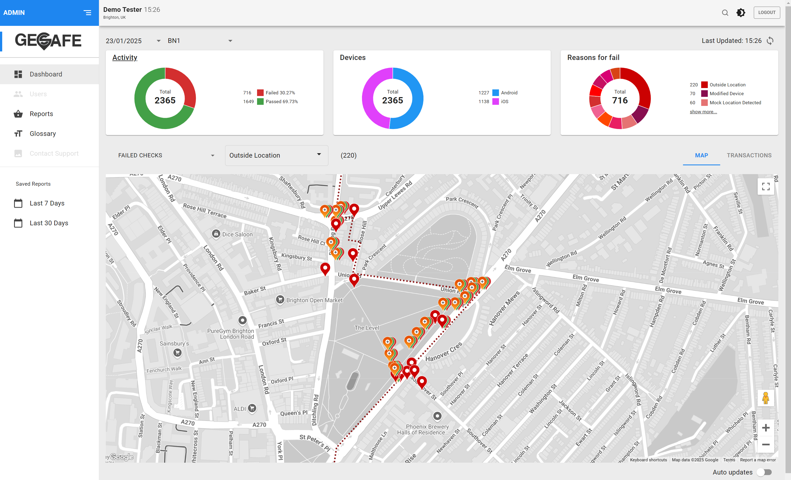

 
VERISON: 0.1 

## Overview 

### Portal Access 

#### Web Address 

The ACT-GeoSafe Admin Portal can be found at the following Address: 

https://test.advancedcompliance.tech/login 

#### Login 

To Login to the Portal use the credentials sent to you via email – if you haven’t received an email please contact support@fantastic.tech 

## Dashboard 

### Map View 

The Admin Portal Dashboard lets you view lookup data geographically via a map – from this you can quickly spot any patterns/issues you may have with your customers validating their location. 

There are four sections to the Map View screen 

- **Map** 
This section details geographical representation of the lookups for the current day 
 
- **Activity** 
This section displays a pie chart showing the total number of lookups that have occurred on the selected date.  Lookups made inside the region are represented by green and the lookups that fail or are outside are represented by red. 

- **Devices** 
This section displays a pie chart showing the total number of lookups, split by device type, on the specified date. 

- **Top 3 reasons for fail** 
This chart shows the top three reasons for unsuccessful lookups and splits them up by the reason they failed – To view all the failures click on the Top 3 Reasons for Fail link 

Data Filters  

There are 3 filters that can be applied to the map, they are available on the top left of the map: 

## Lookup Reponses 
<table>
  <tr>
    <td>
      
    </td>
    <td>
      <b>Inside location</b> 
          This is returned if the device requests a location from within the designated jurisdiction
    </td>
  </tr>
  <tr><td>&nbsp;</td></tr>
  <tr>
    <td>
      
    </td>
    <td>
      <b>Outside location</b> 
          This is returned by the middleware when it detects that the device is outside of location
    </td>
  </tr>
</table>

- **Device not supported** 
This is returned when the SDK detects that the device does not support GPS 

- **Unknown location** 
This is returned if the device requests a location check before the service has completely started and therefore, we do not have a current location for the device. 

- **Location disabled** 
This is returned when the SDK detects that the device has disabled its GPS 

- **Modified device** 
This is returned if the SDK detects that the device is jailbroken 

- **Mock location detected** 
This is returned if the SDK detects that the location is simulated by software (i.e. FakeGPS) 

- **Undetermined location** 
Should never happen – occurs when we have bad config in the DB for that app and not able to determine if it is inside or not 

- **Developer Mode** 
This is returned if the SDK detects that device is running in developer mode 

- **Device Blocked** 
This is returned if the backend system finds this device on a blocked accounts list 

- **Account Blocked** 
This is returned if the backend system finds this account on a blocked accounts list 

- **Global Blocked** 
This is returned when the middleware detects that the Device is on the GeoSafe’s Global Blocked list, which means the device is blocked across all jurisdictions 

- **Proxy Detected** 
This is returned if the backend system finds determines that this device is running a VPN 

- **Other** 
Any other reason other than these listed 

 

 

 