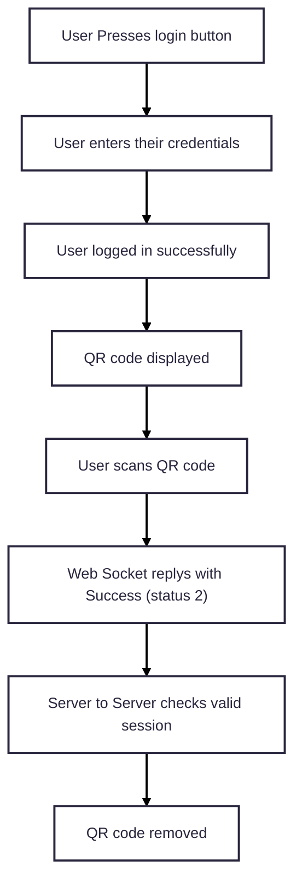

## Overview

Recommended user flow:

#### Initialise 

The first call to the SDK is the Initialization call.  This requires an API Key to identify who you are and what Jurisdiction you are licensed to. 

The customer downloads the ACT Verify app to their mobile device.  Once installed they must scan a QR code to initialise the SDK – The QR code is generated by ACT Verify and displayed on your website. 

#### Start / Stop location service 

After successfully initializing the SDK with a QR Code, use this method to start a validation timer. This timer checks whether the user has validated their location by scanning the QR code using the ACT Verify App within the server-specified timeout. 

The customer can use the Extend Session button to restart the clock so that the Session Expires Time does not run out.  Every time the customer extends their session their location is checked again. 

